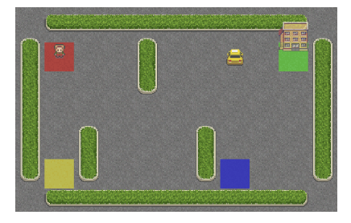
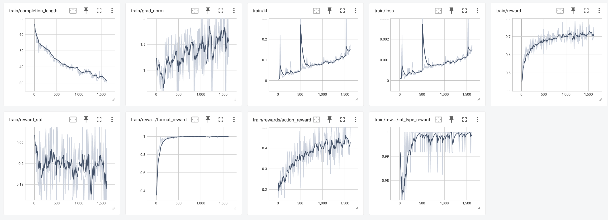

# Fine-tune a tiny DeepSeek model to solve the Taxi Game using Group Relative Policy Optimization (GRPO)


GRPO is a RL algorithm first introduced by the [DeepSeek Math Paper](https://arxiv.org/abs/2402.03300) and is one of the key innovations contributing to the reasoning capabilities of [R1](https://arxiv.org/abs/2501.12948).

Our goal is to test GRPO on a relatively small LLM to determine whether we can fine-tune a small model to solve our custom complex reasoning task — one that it previously could not solve by solely a prompt and without any existing reasoning data. Exploring also smaller open source models and analyzing and understanding the results will help to build better reasoning models in the future.

For this we leverage the [taxi environment](https://gymnasium.farama.org/environments/toy_text/taxi/) from gymnasium.

# The Game

 

The game is about the taxi navigating to the passenger in a grid world, picking them up, and drive to the destination while avoiding obstacles and dropping them off.

The taxi can take in each time step the following actions:

``` 
0: Move south
1: Move north
2: Move east
3: Move west
4: Pick up passenger
5: Drop off passenger
```

# Data
We create a small dataset of approximately 300 state examples from the taxi simulation environment to serve as input for fine-tuning. This dataset does not include any supervised (reasoning) examples typically used to train reasoning in a supervised manner.

We used the Gym environment with `render_mode="ansi"` (which gives us colorized terminal codes) and convert the output of each state into a human-readable string. Although the Gym environment also provides state outputs in the form of images, our goal is to test GRPO on a text-based LLM rather than a multimodal one—at least for now.

The game world consists of a 5x5 grid enclosed by a border of + and - characters. The taxi, passenger, and destinations are placed in specific locations, and walls (|) restrict movement. 
The colons (:) signal that the taxi can cross-over. Walls cannot be crossed-over.
    
**Example state**:

```
161,"+---------+, |Passenger waiting: | : :destination|, | : | :Taxi (empty): |, | : : : : |, | | : | : |, | | : | : |, +---------+"
```
This state has ID 161 (given by the environment).

This state describes:
* Passenger (waiting) and destination at the 1. row.
* Taxi is in the 2. row
* For this state, the target is to pick up the passenger in the 1. row. Then drop him off at the destination. This requires moving down again due to the wall in between (the |).

Refer to the prompt examples in `prompts.py` and the [documentation](https://gymnasium.farama.org/environments/toy_text/taxi/) for more details on the map structure and game mechanics.

# Reward functions

For the learning process, we need to reward the agent's actions. Similar to the approach in the DeepSeek paper, we design simple reward functions that provide a binary yes/no feedback for a given action. The goal is to encourage the agent to self-evolve and develop reasoning capabilities over time **without any supervised data**.

We apply the following three reward functions:

1. Format Reward: Similar to the DeepSeek paper and [Open-R1](https://github.com/huggingface/open-r1), this reward ensures the agent's output follows the required format: `<think></think><answer></answer>`.

2. Integer Reward: The agent is rewarded if the predicted action is a valid integer between 0 and 5, rather than an incorrect format such as a text variant (e. g. `move west`).

3. Action-Based Reward: This reward evaluates whether the agent's action brings the taxi closer to its target. The target depends on the taxi’s state—if empty, the target is the passenger; if occupied, it is the destination. The agent receives immediate feedback based on the effectiveness of its decision.

# Set-up

We set up our environment with the Hugging Face's transformers, pytorch and trl libraries from the `requirements.txt` and run the script `src/grpo-taxi.py` on a GPU (e. g. A100) with enough memory. If you get OOM, adjust the parameters i. e. `batch size, num_generation, etc.` or use a quantization of the model (example in the script).

# Hyperparameters

We use the following parameters for fine-tuning:

```python
GRPOConfig(
            learning_rate=1e-5,
            beta=0.01,  # (KL coefficient) 
            reward_weights=[0.25, 0.25, 0.5],
            per_device_train_batch_size=6,
            gradient_accumulation_steps=2,
            bf16=True,
            max_completion_length=128,
            num_generations=6,
            max_prompt_length=None, # use full prompt input
)
```

# Key Observations

* The model quickly learns the desired structured output format: `<think>...</think>\n<answer>...</answer>`.
* By step 400, it achieves nearly 100% format correctness.
* Initially, the model has an accuracy of about 20% in predicting the correct action.
* Learning progresses very slowly, with the model gradually converging to around 40% accuracy after approximately 800 training steps.
* Beyond step 1000, accuracy still appears to improve, but at a very slow pace. We observe no significant further progress, and the model continues to struggle with certain scenarios, such as when the passenger is not empty (see below).
* With the chosen hyperparameters, fine-tuning requires substantial computational resources, taking approximately 16 hours for 1600 training steps.


# Observations from examples

* The agent faces significant challenges in properly understanding its environment and accurately recognizing and locating objects on the map.

* The agent performs best at accurately predicting the correct action in scenarios where the taxi is empty and needs to move north or south. This could be due to the imbalance in the data, as the majority of states involve an empty taxi.

* In all other scenarios, the agent struggles significantly. While the predicted actions may still be correct, the reasoning is often flawed—either slightly inaccurate or completely incoherent. For example, when the taxi is carrying a passenger, it was nearly impossible to find a single instance with proper reasoning.

* The imbalance (255 states with an empty taxi vs. 100 with a passenger) may be a key factor, as the dataset is both small and skewed. Of course, the data could be more diverse and balanced, and additional samples could be easily collected from the simulation environment. However, for an initial attempt, this data was a good first shot.

* Cases where the reasoning is flawed but the predicted action is correct could be a result of reward hacking.

* Even worse, the agent sometimes predicts the wrong action (leading to negative rewards) despite having fairly good reasoning—it simply draws the wrong conclusion. This suggests that the agent is beginning to develop correct reasoning, but the further refinement of reasoning is suppressed. The current reward functions may even favor non-reasonable reasoning (reward hacking).  Improving the reward functions could help mitigate this issue.

* DeepSeek emphasizes the importance of a strong base model. Perhaps the Qwen model used here is not powerful enough, and models like LLaMA or others might perform better for our task.

* It's quite interesting that even a 1.5-billion-parameter knowledge model struggles to distinguish between left and right, or top and bottom. This could indicate a training bias in the model itself.


## Experiment results tensorboard




# Examples

Some examples illustrating the agent's evolution.

### Examples at early stage (< 50 steps)

The agent immediately attempts to perform reasoning steps - or at least mimic them.

```
<think> The passenger's location is at the bottom left. The taxi is at (2, 3); the destination is at (3, 0).
</think>
<answer>3</answer>
State description: +---------+, | : | : :destination|, | : | : : |, | : : : : |, | |Taxi (with passenger): | : |, | | : | : |, +---------+
```

```
<think>The passenger is at the top left corner and the destination is the middle right corner. The taxi can only move south (Action 0) to reach the passenger.</think>
<answer>0</answer>
State description: +---------+, | : | : :Passenger waiting|, | : | : : |, | : : : : |, | | :Taxi (empty)| : |, | | : |destination: |, +---------+
```

```
<think>
To determine the optimal action, let's consider the following:
1. The taxi is initially at the bottom-left corner of the grid. The passenger is at one of the designated pick-up locations.
2. There are no other passengers or destinations in the vicinity.
3. The only possible action is to move to the passenger's location.
Therefore, the optimal action is to move north (action 0) to the passenger's location.
</think>
<answer>0</answer>
State description: +---------+, | : |Taxi (empty): :Passenger waiting|, | : | : : |, | : : : : |, | | : | : |, | | : |destination: |, +---------+
```

```
<think>
The taxi is currently at the top left corner and needs to reach the Passenger waiting at the bottom middle row for them to get into the taxi.
</think>
<answer>3</answer>
State description: +---------+, | : | : :destination|, | : | : : |, | : : : :Taxi (empty)|, | | : | : |, | | : |Passenger waiting: |, +---------+
```

### Examples at step > 1000

The reasoning is sometimes very precise and well-structured, even though the final conclusion—or parts of the reasoning—are incorrect.

```
<think> Analyze the game state:
- The taxi is currently at the bottom left corner.
- The passenger is at the top right corner.
- The destination is in the middle right.
- The taxi can move south to reach the passenger or north to reach the destination.
- The passenger is not yet inside the taxi or at the destination.
- The optimal move is to move south to reach the passenger.</think>
<answer>0</answer>
State description: +---------+, |destination: | : :Passenger waiting|, | : | : : |, | : : : : |, |Taxi (empty)| : | : |, | | : | : |, +---------+
```
Some parts of the reasoning steps are already heading in the right direction.

```
<think>The passenger is at the top-left corner, and the taxi starts at the bottom-right corner. To reach the passenger, the taxi must move north or south.</think>
<answer>1</answer>
State description: +---------+, |Passenger waiting: | : : |, | : | : : |, | : : : : |, | | : | : |, | |Taxi (empty): |destination: |, +---------+
Action reward: 1.0, Env reward: -1
```
The reasoning appears solid when the final action is correct, but the final conclusion (north or south) is contradictory. This still suggests a fundamental lack of true reasoning.

```
<think>The taxi is at the top and the passenger is at the bottom, so moving south will bring the taxi closer to the passenger.</think>
<answer>0</answer>
State description: +---------+, | : | : : |, | : | : : |, | :Taxi (empty): : : |, | | : | : |, |destination| : |Passenger waiting: |, +---------+
```

Correct—but, of course, the taxi is not at the **very top**; everything is relative. :) This again highlights that the current reward function allows flexibility in reasoning while still producing the correct action, even without knowing every detail precisely. This is a classic case of reward hacking.

```
<think>The taxi is at the south-west corner, facing east. The passenger is at the north-east corner and the destination is at the south-east corner. The taxi should move south to reach the passenger.</think>
<answer>0</answer>
State description: +---------+, |destination: | : : |, | : | : : |, | : :Taxi (empty): : |, | | : | : |, |Passenger waiting| : | : |, +---------+
Action reward: 1.0, Env reward: -1
```

Correct action but with wrong reasoning of the locations.


### Cases with correct action + reasoning (mostly for empty taxi moving north/south) (Steps > 1000)


```
<think>The taxi should move north to reach the passenger.</think>
<answer>1</answer>
State description: +---------+, |Passenger waiting: | : :destination|, | : | : : |, | : : : : |, | | : | : |, | | : |Taxi (empty): |, +---------+
```

```
<think>The taxi is at the northernmost row and the passenger is at the southernmost row. Move south to reach the southernmost row.</think>
<answer>0</answer>
State description: +---------+, |destination: |Taxi (empty): : |, | : | : : |, | : : : : |, | | : | : |, | | : |Passenger waiting: |, +---------+
```


### Correct examples with reasoning issues


```
<think>The taxi is at the north-west corner. The passenger is at the destination. The taxi needs to move south to reach the destination.</think>
<answer>0</answer>
State description: +---------+, |destination: | : :Taxi (empty)|, | : | : : |, | : : : : |, | | : | : |, | | : |Passenger waiting: |, +---------+
Action reward: 1.0, Env reward: -1
```
The orientation is incorrect—the taxi is actually in the northeast, not the northwest. Additionally, the passenger has not yet reached the destination.

```
state_description: +---------+, | : | : :Passenger waiting|, | : | : : |, | : :Taxi (empty): : |, | | : | : |, | | : |destination: |, +---------+
 <think>The taxi needs to move north to drop off the passenger.</think>
<answer>1</answer>
```
The agent still does not seem to understand the difference between picking up and dropping off the passenger.


### Examples where the actions are correct, but the reasoning is completely flawed

```
<think>The taxi should move north to avoid the destination at the bottom and pick up the passenger at the top.</think>
<answer>1</answer>
State description: +---------+, |destination: | : : |, | : | : : |, | : : : : |, | | : | :Taxi (with passenger)|, | | : | : |, +---------+
Action reward: 1.0, Env reward: -1
```

```
<think>The taxi is at the top and north movement is the first option to reach the passenger.</think>
<answer>1</answer>
State description: +---------+, |destination: | : : |, | : | : : |, | : : : : |, | | :Taxi (with passenger)| : |, | | : | : |, +---------+
Action reward: 1.0, Env reward: -1
```

```
<think>The taxi and passenger are not on the same location. The passenger is at a destination, but the taxi is not visible. We should move north to check if the passenger is at the destination.</think>
<answer>1</answer>
State description: +---------+, | : | : :destination|, | : | : : |, | : : : : |, | | :Taxi (with passenger)| : |, | | : | : |, +---------+
Action reward: 1.0, Env reward: -1
```

```
<think>The taxi is at the start and needs to move south to reach the passenger.</think>
<answer>0</answer>
State description: +---------+, | : | : : |, | : | : : |, | : : :Taxi (with passenger): |, | | : | : |, |destination| : | : |, +---------+
```

```
<think>The taxi can travel north to reach the Passenger.</think>
<answer>1</answer>
State description: +---------+, |destination: | : : |, | : | : : |, | :Taxi (with passenger): : : |, | | : | : |, | | : | : |, +---------+
```

```
<think>The taxi needs to move north to reach the passenger at the destination.</think>
<answer>1</answer>
State description: +---------+, | : | : :destination|, | : | :Taxi (with passenger): |, | : : : : |, | | : | : |, | | : | : |, +---------+
```
The agent fails to recognize that the taxi is already carrying the passenger and that the target should be the destination, not the passenger.


# Conclusion

* Even at very early stages, the agent follows a reasonably precise structure with a hint of logic in its thinking. Prompting it to think step by step, without providing explicit examples, appears to have a significant impact. The reasoning steps read well, but the actual reasoning is often not very sound. At times, it feels as though the agent is merely assembling key words in a logical order to make the output look good rather than truly reasoning. I believe this is the core issue, and fine-tuning should focus on guiding the agent to refine these raw reasoning steps into genuinely correct ones.
  
* This seemingly simple task (from a human perspective) already presents a significant challenge for this small LLM. Relying solely on pure reinforcement learning appears to impose limitations on developing proper reasoning from scratch.
  
* We observe potential reward hacking, as the reward functions seem to allow for exploitation. We need better or additional reward functions to foster proper reasoning—for example, a template schema to structure the reasoning process effectively. The DeepSeek paper does not mention anything about reward hacking in relation to the reward function they used, except for noting that it was observed when using a neural reward model.
  
* Initially, I tested the smaller distilled DeepSeek models, up to 14B, but the early results were not promising. The distilled versions are merely base models, not instruction-tuned, making it difficult for them to learn even the structured format. As a result, significantly longer training would be required. It would be interesting to compare these with math-instruct models like `Qwen2.5-Math-Instruct`. The Qwen instruct models showed the most promise, which is why I chose them for these experiments.

* There is still no free lunch—simply designing a simple reward function is not enough. DeepSeek achieved their "aha moment" by leveraging massive amounts of data, a highly capable base model, and extensive compute resources, with significantly longer training times (around 8,000 steps).

* Achieving similar results with smaller models requires more careful reward function engineering (and possibly prompt engineering) to prevent reward hacking and improve reasoning capabilities.

* The model must not be too small.

* We already use a detailed prompt as the base prompt, which may introduce bias. Initial findings suggest that the smaller model requires some hints to perform effectively. DeepSeek used a very simple template prompt (which we use as the system prompt). While this approach could potentially be beneficial in our case, it would likely require significantly longer training than what we have conducted so far.

  >We intentionally limit our constraints to this structural format, avoiding any content-specific biases—such as mandating reflective reasoning or promoting particular problem-solving strategies—to ensure that we can accurately observe the model’s natural progression during the RL process.
(source: https://arxiv.org/html/2501.12948v1)
  
* Initial tests with a more detailed prompt containing a single example of the map showed even worse results, as the LLM consistently adhered to the example. This suggests that a zero-shot prompt is more suitable.

* We use a short response length (128 tokens), which may be too limited for the model to develop proper reasoning. In the paper, the LLM is allowed to generate outputs of up to 12,000 tokens (Figure 3 in the paper). A longer response length might be necessary for effective reasoning. They also found that the "aha moment" requires a sufficient number of tokens, allowing the model to allocate more thinking time on the problem by reevaluating its approach.


## How can you contribute?

Reasoning in other environments offered by gymnasium could be explored, or leverage them to generate new kind of reasoning data / benchmarks for better reasoning models.

# References & Acknowledgments

* [Open-R1](https://github.com/huggingface/open-r1) - Fully open reproduction of DeepSeek-R1

